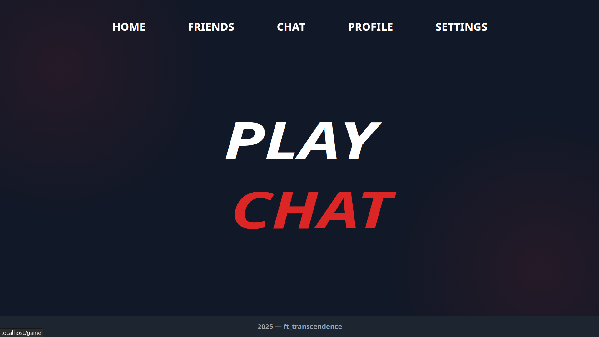
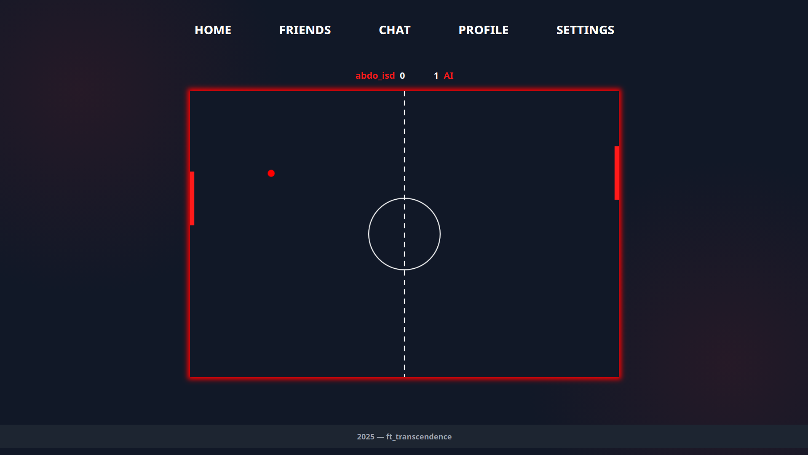
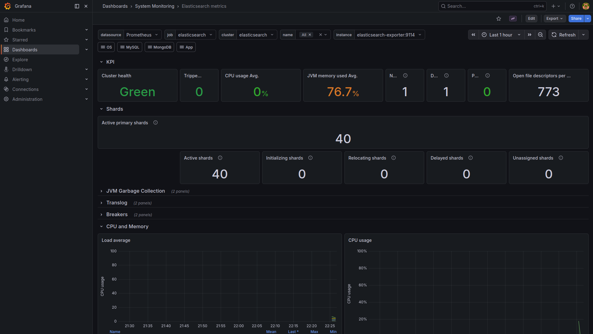
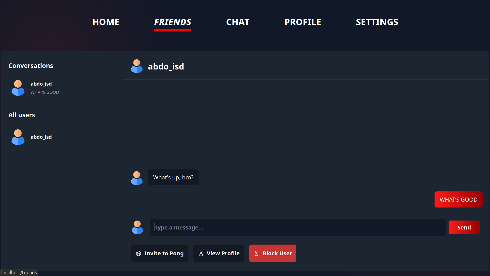
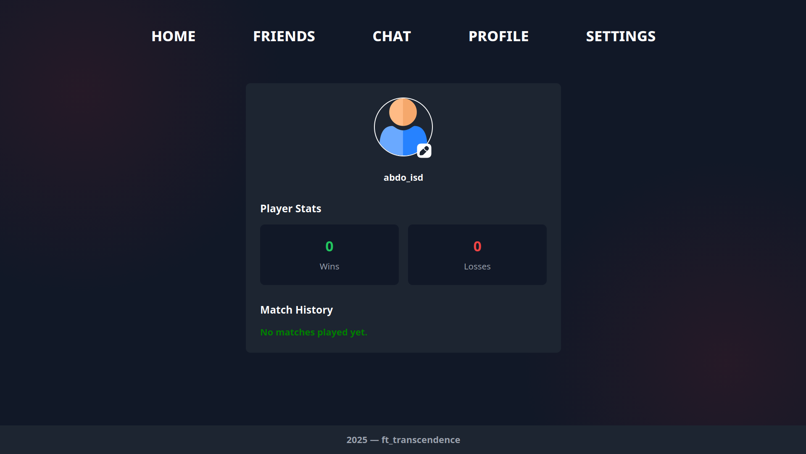

# ft_transcendence

A containerized full‑stack web app with:
- **Frontend** (SPA) served behind **Nginx**
- **Backend** (Fastify + Socket.IO) with **SQLite**
- **Google OAuth2** login + optional **2FA**
- **Chat** (real‑time) + **Pong** game modes (AI / remote / tournament / API mode)
- **Observability stack** (ELK + Prometheus/Grafana exporters)

Repo orchestration is done via [docker-compose.yml](docker-compose.yml) and [Makefile](Makefile).

---

## Demo (screenshots)

| # | Screenshot |
|---|------------|
| 1 |  |
| 4 |  |
| 5 |  |
| 2 |  |
| 3 |  |

---

## Project layout

- Root:
  - [.env](.env)
  - [docker-compose.yml](docker-compose.yml)
  - [Makefile](Makefile)
- App:
  - Backend: [src/app/backend/](src/app/backend/)
  - Frontend: [src/app/frontend/](src/app/frontend/)
- Proxy: [src/proxy/](src/proxy/)
- Vault: [src/vault/](src/vault/)
- ELK: [src/elk/](src/elk/)
- Monitoring: [src/monitoring/](src/monitoring/)

---

## Features

### Auth
- Google OAuth2 login flow (redirects through backend, then frontend routes)
- JWT stored client-side for API calls / WebSocket auth
- Optional 2FA (TOTP) setup and verification

### Chat
- List conversations + users
- Real-time messaging (Socket.IO namespace)
- “Invite to Pong” messages (invite/accept flow)

### Game
- Multiple modes exposed in the UI (AI / 3D / remote / tournament / API mode)
- API mode endpoints for initializing/starting games

### Monitoring / Logging
- ELK stack (Elasticsearch, Logstash, Kibana) under [src/elk/](src/elk/)
- Prometheus/Grafana stack under [src/monitoring/](src/monitoring/)

---

## Architecture (high level)

- **Reverse proxy (TLS)**: [src/proxy/](src/proxy/)  
- **Frontend**: [src/app/frontend/](src/app/frontend/)  
- **Backend**: [src/app/backend/](src/app/backend/)  
  - Serves SPA static files and backend endpoints
  - Hosts Socket.IO server (game + chat)

---

## Quick start (Docker Compose)

### 1) Configure environment
Edit [.env](.env) (values shown there are placeholders / dev defaults).

Important variables you’ll typically set:
- `CLIENT_ID`, `CLIENT_SECRET`, `REDIRECT_URI` (Google OAuth2)
- `SERVER_URL` (public origin used by backend/ws CORS)
- `WEBSITE_URL` (backend uses it for some internal fetches)
- `WS_URL` (frontend uses it to connect to Socket.IO)

### 2) Build + run
Using Make:
- `make` (same as `docker compose up`)
- `make build`
- `make down`

Or directly:
- `docker compose up --build`

See: [Makefile](Makefile), [docker-compose.yml](docker-compose.yml)

### 3) Open
- App: `https://localhost` (via Nginx)
- Backend (internally): `http://localhost:3000` (depends on your compose mapping)
- WebSocket: `wss://localhost` (matches `WS_URL`)

---

## Development notes

### Frontend
Location: [src/app/frontend/](src/app/frontend/)  
- Built into a bundle (served from backend static hosting volume)
- SPA routes handled client-side; unknown paths return `index.html` from backend

### Backend
Location: [src/app/backend/](src/app/backend/)  
- Fastify server with JWT + multipart + static serving
- SQLite database created on startup
- Chat/game websockets live on the same server
